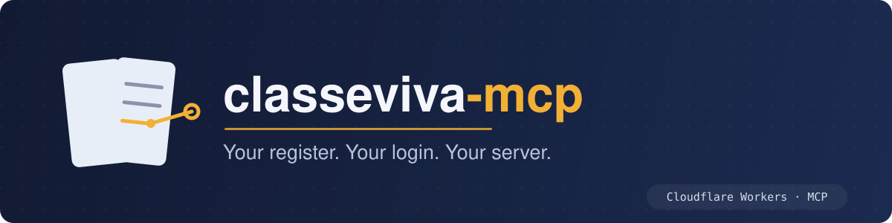

<p align="center">
  
</p>

# classeviva-mcp

A self-hosted MCP server for the [ClasseViva](https://web.spaggiari.eu/) school
register, running on Cloudflare Workers. It exposes 14 tools over Streamable HTTP,
guarded by Cloudflare Access — see [Configure your own](#configure-your-own) for
your own instance.

One deployment can serve more than one person. Cloudflare Access decides who may
even reach the server; each of those identities then signs in with its **own**
ClasseViva login, entered once in a form shown right after Access and bound to
that person's OAuth grant from then on. There is no shared register account.

Responses are compacted before they reach the model. The school calendar, for
instance, goes from 22 KB to 2 KB without losing the answer to "is there school on
the 14th".

## How it fits together

```
MCP client ──OAuth──> workers-oauth-provider ──> createMcpHandler ──> tools
                             │                                          │
                     Cloudflare Access                          ClasseViva client
                   (identity, then a                           (login, compaction)
                  ClasseViva login form)

browser ──HMAC-signed link──> /attachment ──────────────────────────> PDF
```

- **Identity** comes from a Cloudflare Access for SaaS (OIDC) app. Two separate
  gates sit in front of a token: Access's own policy decides who even reaches the
  Worker (reject there and you see Access's own denial page, before any of this
  code runs), and `ALLOWED_EMAILS` decides who among those identities gets one —
  everyone else is refused a token and, failing that, sees zero tools. Both must
  list an identity for it to work; adding someone to one and not the other is the
  most common setup mistake (see [Troubleshooting](docs/quickstart.md#troubleshooting)).
- **ClasseViva credentials** are entered by each identity, once, in a form shown
  right after Access confirms who they are — not a Worker secret. They are
  validated against ClasseViva itself before anything is minted, then carried on
  that identity's OAuth grant. A login that is itself a Genitore account linked to
  more than one child gets a second form to pick which one. `CLASSEVIVA_ID` /
  `CLASSEVIVA_PASSWORD` in `.env` still exist, but only as a fallback for a grant
  minted before this form existed — a fresh install never uses them for a real
  login.
- **Attachments** sit outside the OAuth gate and carry their own proof — see
  [Attachments](#attachments).
- **State**: none beyond the OAuth grant itself. Each request logs in to
  ClasseViva unless a warm isolate still holds a valid token (they last 90
  minutes).

## Tools

| Tool | What it answers |
|---|---|
| `profile` | Who am I, which school, which subjects and teachers, which terms |
| `grades` | Marks, with averages overall, per subject and per term |
| `agenda` | Homework and scheduled work, defaults to the next 14 days |
| `homework` | The text of an assignment the agenda only points at |
| `lessons` | What was actually covered in class, consecutive hours merged |
| `absences` | Absences, late arrivals, early leaves, with totals |
| `notes` | Disciplinary notes, text included |
| `noticeboard` | School notices, with a link per attachment |
| `read_notice` | A notice's full body — **marks it as read** |
| `read_attachment` | An attachment's text, so the model can read it — **marks the notice as read** |
| `calendar` | School days as date ranges |
| `schoolbooks` | Adopted textbooks |
| `didactics` | Material shared by teachers |
| `documents` | Documents and school reports |
| `summary` | Everything for a date range in one call |

Every read-only tool takes `format: "raw"` to bypass compaction and return the
API's own JSON.

There is also one resource (`classeviva://profile`) and two prompts
(`week-review`, `whats-due`).

## Attachments

A notice attachment is a real PDF — around 200 KB in practice, roughly 270 KB once
base64-encoded. Returning those bytes through MCP would fill the model's context
with something it cannot read anyway, so there are two separate paths instead.

**For a person:** `noticeboard` returns a link per attachment.

```json
"attachments": [
  {
    "fileName": "Avviso 021.pdf",
    "attachNum": 1,
    "url": "https://your-domain/attachment/CF/90000003/1?exp=1789565932&sig=tD9ig…"
  }
]
```

Open it in a browser and the file downloads. A browser sends no `Authorization`
header, so the route cannot sit behind the OAuth token — the link carries its own
proof instead: an HMAC over `evtCode/pubId/attachNum` **and** the expiry, signed
with `LINK_SIGNING_KEY`, which only the Worker knows. Changing the attachment
number or extending the expiry invalidates the signature. Links last one hour;
after that, ask for the notice again to get a fresh one.

**For the model:** `read_attachment` fetches the same file and converts it with
Workers AI `toMarkdown`, returning a few KB of text instead of the bytes. It works
on images too, though those get described rather than transcribed. Output is capped
at 20,000 characters, with `truncated: true` when it was cut.

### Both of them mark the notice as read

ClasseViva refuses to serve an attachment for a notice that has never been opened:

```
GET  /noticeboard/attach/CF/90000002/1  →  404 "item must first be read"
POST /noticeboard/read/CF/90000002/101  →  200, marks it read
GET  /noticeboard/attach/CF/90000002/1  →  200 application/pdf
```

So both paths open the notice first, and that cannot be undone. This mirrors the
web app, where a file is only reachable by opening the notice that carries it.

It marks the notice **read**. It does not **sign** — `needSign` is a separate
action this code never performs, and stayed `true` on every notice requiring a
signature across a full run of all attachments.

`/attachment/*` deliberately stays at the root while the MCP endpoint sits under a
path prefix. `workers-oauth-provider` matches API routes with `startsWith`, so
anything under the MCP prefix would be swallowed by the OAuth gate — and these
links would stop working.

This is not specific to attachments: **any** custom route added to
`access-handler.ts` must not start with `MCP_ROUTE` (`/classeviva` by default),
or `workers-oauth-provider` treats it as an MCP API call and demands a Bearer
token before the route's own code ever runs — the request 401s with no log line
from this repo's code at all, because it never reached it. The sign-in form's
own route is named `/login` rather than `/classeviva-login` for exactly this
reason; the latter starts with `/classeviva` and silently 401s.

## Configure your own

Nothing in this repo is specific to one school or one student except the values
you set below. Configuration is split in two, by whether it is safe to commit:

| | Where | Committed? | How to change it |
|---|---|---|---|
| **Secrets** | `.env`, uploaded on deploy | never | edit `.env`, then `npm run deploy` |
| **Deployment config** | `wrangler.jsonc` | yes | edit, then `npm run deploy` |

The deploy script is `wrangler deploy --secrets-file .env`, so **`.env` is the
source of truth for production secrets** and one command pushes both code and
credentials. Three things follow from that:

- A missing `.env` makes the deploy **fail outright** with `ENOENT` — it does not
  deploy without them. A fresh clone has to create it first.
- Everything in `.env` is uploaded, so keep it to the nine names in
  `.env.example` and nothing else.
- Uploading is **additive**: secrets already on the Worker but absent from the file
  are preserved, not deleted.

`.env` also feeds `npm run dev`, so the same file covers local development.

Two behaviours that are easy to get backwards: `vars` in `wrangler.jsonc` are wiped
and rewritten on every deploy, while **secrets are never deleted by a deploy**.

`wrangler.jsonc` is committed, so it ships with placeholder `ALLOWED_EMAILS` and
KV id — real values go in your own clone, not in a commit. If your fork of this
repo is itself public, keep git from ever noticing that local edit:

```bash
git update-index --skip-worktree wrangler.jsonc
```

Git then treats the file as unchanged no matter what it locally holds; `git
status` stays clean and `git add -A` can't re-leak it. Undo with
`--no-skip-worktree` on the rare occasion you actually mean to commit a change to
this file.

### 1. Cloudflare Access application

Zero Trust → Access → Applications → Add an application → **SaaS**, protocol
**OIDC**. Redirect URL `https://<your-domain>/callback`, scopes `openid email
profile`. Add a policy allowing your email — and everyone else's, if more than
one person will use this deployment; this list and `ALLOWED_EMAILS` (step 3) are
separate gates that both need an identity listed. **One-time PIN** sends you a
code by email and needs no third-party identity provider.

Keep five values from that page: Client ID, Client secret, Authorization endpoint,
Token endpoint, Key (JWKS) endpoint.

### 2. KV namespace

```bash
npx wrangler kv namespace create OAUTH_KV
```

It stores OAuth grants and tokens. Put the printed id in `wrangler.jsonc`.

### 3. `wrangler.jsonc`

Five things to change:

```jsonc
"name": "classeviva-mcp",                                  // your Worker's name
"kv_namespaces": [{ "binding": "OAUTH_KV", "id": "…" }],   // from step 2
"vars": {
    "ALLOWED_EMAILS": "you@example.com,someone.else@example.com", // who may use it
    "PUBLIC_HOSTNAME": "mcp.example.com",                  // your custom domain
    "MCP_ROUTE": "/classeviva"                             // the MCP endpoint's path
},
"routes": [{ "pattern": "mcp.example.com", "custom_domain": true }]
```

`ALLOWED_EMAILS` is not a secret — it is a list of who is allowed in, not a
credential, so `vars` is the right home for it. Empty denies everyone: it fails
closed. A comma separates several addresses — each one still needs its own
ClasseViva login (see below) and must also be in the Access application's own
policy; this var only covers the second of those two gates.

`PUBLIC_HOSTNAME` exists for Host-header validation. `localhost` and
`*.workers.dev` are allowed by default, so **deploying to workers.dev needs neither
this var nor the `routes` block** — drop both and the `*.workers.dev` URL from the
deploy just works. A custom domain gets no such allowance and must be named here,
or every request is rejected.

`MCP_ROUTE` is the path the MCP endpoint is served at. It defaults to
`/classeviva` — most forks can leave it alone; change the value if you want a
different URL segment, but keep the key present.

### 4. Secrets

Copy `.env.example` to `.env` and fill in the nine values — five from step 1, two
you generate with `openssl rand -hex 32`, and `CLASSEVIVA_ID` / `CLASSEVIVA_PASSWORD`.
They upload on the next deploy.

The deploy script still requires those last two and still uploads them, but a
fresh install never actually logs in with them — every identity enters its own
ClasseViva ID and password in the sign-in form described in
[Signing in](#signing-in), and that is what gets used. Any non-empty placeholder
value satisfies the deploy; there is no need for it to be a real, working login.

To rotate a single value later without touching the file, or to set one on a Worker
you are not deploying to right now:

```bash
npx wrangler secret put CLASSEVIVA_PASSWORD
```

That takes effect immediately, no deploy needed. `npx wrangler secret list` shows
what the Worker currently holds — expect exactly those nine names.

When piping a value in, use `printf` rather than `echo`, so no trailing newline
lands inside the secret:

```bash
printf '%s' "$CLASSEVIVA_PASSWORD" | npx wrangler secret put CLASSEVIVA_PASSWORD
```

### 5. Deploy

```bash
npm install
npm run cf-typegen   # regenerates worker-configuration.d.ts from wrangler.jsonc
npm run deploy
```

`cf-typegen` is gitignored and derived — run it again any time you change
`wrangler.jsonc`'s `vars`, or `tsc`/your editor will type-check against stale
values.

That uploads the code, the `wrangler.jsonc` config, and the secrets from `.env` in
one go. The first deploy also creates the DNS record for a custom domain.

For local work, `npm run dev` serves on `localhost:8788` reading the same `.env`.
If you prefer Wrangler's own `.dev.vars` file, be aware it **shadows** `.env`
entirely rather than merging — every value the Worker needs has to be in it.

## Signing in

After Access confirms who you are (the OTP step), you land on a form asking for
your ClasseViva ID and password — the same ones you use in the ClasseViva app.
That login is validated against ClasseViva itself before anything is minted: a
wrong ID or password re-shows the form with an error, not a failure three steps
later inside the first tool call.

If that ClasseViva login is itself a Genitore account linked to more than one
child, a second screen asks which one this sign-in is for. A single-profile
login skips straight past it. Either way the choice is bound to your OAuth
grant — a later reconnect reuses it without asking again. To force the whole
flow fresh (a changed password, a wrong child picked, a different ClasseViva
login entirely), the connector has to be **removed**, not just reconnected: a
client holding a still-valid token skips straight back to tool calls and never
touches `/login` again. Remove it from the client (claude.ai: Settings →
Connectors → remove; Claude Code: `claude mcp remove classeviva`), then add it
again.

## Connecting

Dynamic client registration means there is no client ID to paste anywhere.

The path below is `/classeviva`, the shipped default — substitute your own if
you changed `MCP_ROUTE` in `wrangler.jsonc`.

- **claude.ai, Desktop, Cowork, mobile:** Settings → Connectors → Add custom
  connector → `https://<your-domain>/classeviva`
- **Claude Code:**
  `claude mcp add --transport http classeviva https://<your-domain>/classeviva`

Either way the browser opens for the Access login. Adding it from the claude.ai
connector panel and from Claude Code are different things — a connector added on
the web syncs down to Claude Code, but one added locally does not appear on the web.

## Verifying a change

There is no test suite. Before a deploy:

```bash
npm run type-check
npm run deploy
```

Then, against the deployed Worker (again, `/classeviva` is the default path —
adjust if you changed `MCP_ROUTE`):

```bash
# unauthenticated access must be refused
curl -s -o /dev/null -w '%{http_code}\n' -X POST https://<your-domain>/classeviva \
  -H 'Content-Type: application/json' \
  -H 'Accept: application/json, text/event-stream' \
  -d '{"jsonrpc":"2.0","id":1,"method":"tools/list"}'   # expect 401

# an unsigned attachment link must be refused
curl -s -o /dev/null -w '%{http_code}\n' \
  https://<your-domain>/attachment/CF/1/1                # expect 400
```

The Access policy and `ALLOWED_EMAILS` together are what stands between a public
URL and the register, so a `200` on the first of those means stop and fix it
before going further.

Note that MCP reports tool failures **inside** the response body with HTTP `200`.
A Cloudflare log showing `status: 200` and `outcome: ok` only means the request
authenticated and the Worker did not crash — to know whether a tool succeeded,
look for `isError` in the body.

## What the API will not give you

Only the current school year is retrievable, and a date range may not end later
than today. Previous years are gone, so any archive has to be built as you go.

`docs/endpoints.md` records that and the rest of what was verified against the live
service — including five places where the obvious call is the wrong one, from the
student id that must be digits only to the attachment segment that is not the
constant the original wrapper assumed.

## Credit

The endpoint map was derived from
[Lioydiano/Classeviva](https://github.com/Lioydiano/Classeviva) (MIT), the Python
wrapper this repository began as, and from
[Classeviva-Official-Endpoints](https://github.com/Lioydiano/Classeviva-Official-Endpoints).

## License

[MIT](LICENSE)
